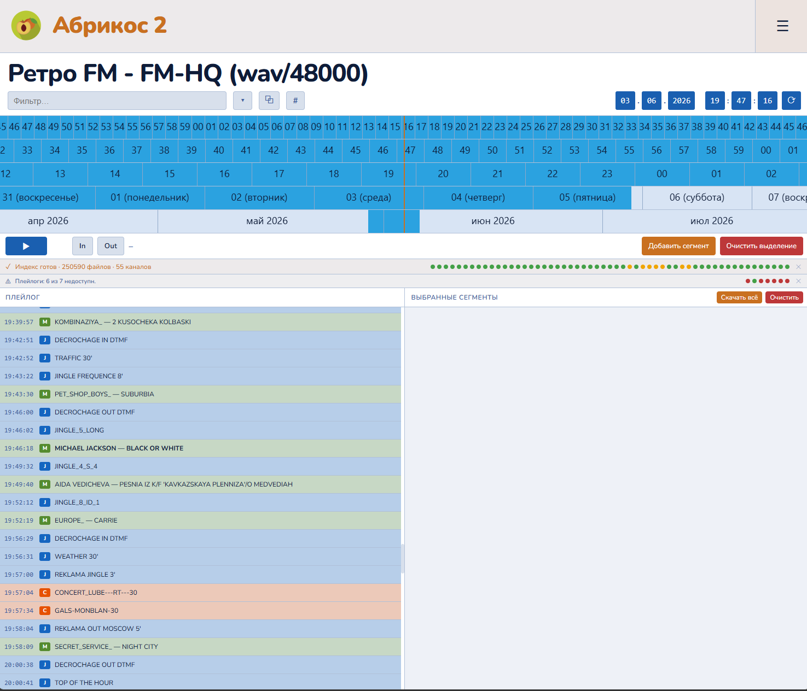

#  Абрикос 2

Веб-приложение для навигации по записям контроля радиоэфира: поиск нужного момента, выделение фрагментов и экспорт в аудиоформат.



## Требования

- Python 3.9+
- [**ffmpeg**](https://ffmpeg.org/download.html) — должен быть установлен и доступен в PATH (или путь указан в `config/settings.yaml`)
  - macOS: `brew install ffmpeg`
  - Ubuntu/Debian: `apt install ffmpeg`
  - Windows: `winget install -e --id Gyan.FFmpeg`
- прочитать документацию последовательно и полностью.

## Установка Python

### Linux (Ubuntu / Debian)

```bash
sudo apt update
sudo apt install ffmpeg python3 python3-venv python3-dev

# Для монтирования SMB-источников
sudo apt install cifs-utils

# Для Kerberos / GSSAPI (только при auth_protocol: kerberos в конфиге SMB)
sudo apt install gcc libkrb5-dev
```

> [!WARNING]
> На Ubuntu 23.04+ и Debian 12+ прямой `pip install` **намеренно заблокирован системой** — используйте виртуальное окружение (см. ниже).

### macOS

Рекомендуется установка через [Homebrew](https://brew.sh/):

```bash
# Установка Homebrew (если ещё не установлен)
/bin/bash -c "$(curl -fsSL https://raw.githubusercontent.com/Homebrew/install/HEAD/install.sh)"

# Установка Python
brew install ffmpeg python
```

Альтернатива — официальный установщик с [python.org](https://www.python.org/downloads/).

### Windows

Откройте **PowerShell** и установите всё через winget:

```powershell
winget install Gyan.FFmpeg Python.Python.3.12
```

После установки Python **перезапустите терминал**, чтобы обновился `PATH`, затем проверьте:

```powershell
python --version
```

## Установка

```bash
git clone https://github.com/ykmn/apricot2
cd apricot2
```

> [!TIP]
> На всех платформах используйте **виртуальное окружение** — это изолирует пакеты проекта от системного Python и избавляет от ошибки `externally-managed-environment` (Ubuntu 23.04+ / Debian 12+).

```bash
cd apricot2

# 1. Создать окружение (один раз)
python3 -m venv .venv        # Linux / macOS
python  -m venv .venv        # Windows

# 2. Активировать окружение (каждый раз перед работой с проектом)
source .venv/bin/activate    # Linux / macOS
.venv\Scripts\activate       # Windows (cmd)
.venv\Scripts\Activate.ps1   # Windows (PowerShell)

# 3. Установить зависимости
pip install -r requirements.txt
# Для Kerberos / GSSAPI (только при auth_protocol: kerberos в конфиге SMB)
pip install -r requirements-kerberos.txt
```

После активации в начале строки терминала появится префикс `(.venv)`. Команду `python apricot2.py` также нужно выполнять с активированным окружением.

> [!CAUTION]
> **Ошибка `externally-managed-environment`** означает, что вы запускаете `pip` вне виртуального окружения на современном Linux. Решение — создать и активировать `.venv` как показано выше. Обходной флаг `--break-system-packages` использовать **не рекомендуется**.

## Конфигурация

### Структура папок конфигурации

```
config/                          # Рабочая конфигурация (создаётся вами)
├── settings.yaml               # Глобальные настройки
├── secret.yaml                 # Учётные данные SMB
├── ldap.yaml                   # Авторизация (опционально — если файл отсутствует, авторизация отключена)
├── users.yaml                  # Локальные пользователи (если Local: true в ldap.yaml)
├── stations/
│   ├── retro_fm.yaml           # Одна станция = один файл
│   └── europa_plus.yaml
└── playlogs/
    ├── retro_fm.yaml          # Один плейлог для станции = один файл
    └── europa_plus.yaml

config.demo/                    # Демо-конфигурация
```

Скопируйте `config.demo/` → `config/` как отправную точку:
```bash
cp -r config.demo/ config/
```

---

### Учётные данные SMB (`config/secret.yaml`)

Все логины, пароли и домены хранятся в одном файле `config/secret.yaml`, на который ссылаются конфиги станций по числовому `id`. Файл добавлен в `.gitignore` и никогда не попадает в репозиторий. Создавайте его сами по образцу:

```yaml
# config/secret.yaml
authorization:
  - id: 1
    username: "logger"
    password: "password1"
    domain: "CORP"
  - id: 2
    username: "svc_radio"
    password: "another_pass"
    domain: "CONTOSO"
  - id: 3
    username: "user1"
    password: "..."
    domain: "EVILCORP"
    auth_protocol: "kerberos"   # кросс-доменный доступ: использует тикет OS
```

**Поле `auth_protocol`** (опционально):

| Значение | Когда использовать |
|---|---|
| не задано / `ntlm` | Сервер в том же домене или доступен по NTLM |
| `kerberos` | Сервер в другом домене/лесу с трастом; машина включена в домен — Kerberos использует текущий тикет Windows, явные credentials игнорируются |

> [!TIP]
> Альтернатива для отдельных каналов — `password_env: "MY_ENV_VAR"` (хранение пароля в переменной окружения).

> [!IMPORTANT]
> **Защита файла от посторонних.** `secret.yaml` содержит пароли в открытом виде — ограничьте права доступа к нему. На Linux/macOS выполните один раз после создания файла:
> ```bash
> chmod 600 config/secret.yaml
> ```
> Это разрешает чтение и запись только владельцу файла. Убедитесь, что приложение запускается от того же пользователя. Файл уже добавлен в `.gitignore` и не попадёт в репозиторий, но права на файловой системе нужно выставить вручную.

---

### Конфигурация станций

#### Подключение через SMB (network share)

Используйте `secret: N`, где N — `id` из `config/secret.yaml`:

```yaml
# config/stations/retro_fm.yaml
id: retrofm
name: "Retro FM"

channels:
  - id: retrofm_pgm
    name: "Retro FM — PGM (mp3/64k)"
    smb:
      host: "fileserver.domain.local"   # имя или IP сервера
      share: "LOGGER"                   # имя сетевой шары
      path: "04 Retro/PGM1"           # подпапка внутри шары (необязательно)
      secret: 1                         # ссылка на запись в secret.yaml
    folder_format: "%Y-%m-%d"
    file_format: "%H-%M-%S"
    file_extension: "mp3"
    sample_rate: 48000
    playlogs:
      - retrofm
    playlogs_offset: 500       # смещение плейлога относительно аудио в мс (положительное — вперёд, отрицательное — назад; по умолчанию 0)
```

Путь на сервере формируется как: `\\host\share\path\<папка-даты>\<файл-время>.ext`.

**`playlogs_offset`** — смещение меток плейлога относительно аудиозаписи в миллисекундах. Плейлог фиксирует момент постановки трека в эфир, тогда как в записи он слышится чуть позже (задержки кодирования, буферизации, сигнальной цепи). Положительное значение сдвигает метки вперёд (плейлог отстаёт от звука), отрицательное — назад. По умолчанию — 0.

Можно также указать учётные данные прямо в конфиге канала (не рекомендуется):
```yaml
  smb:
    host: "fileserver"
    share: "LOGGER"
    path: "04 Retro/PGM1"
    username: "logger"
    password: "passw"
    # или password_env: "MY_VAR"
    domain: "CONTOSO"
```

#### Локально смонтированная папка

Если SMB-шара уже смонтирована как буква диска (Windows) или точка монтирования (Linux/Mac):

```yaml
channels:
  - id: retro_fm_pgm_hq
    name: "Retro FM — PGM-HQ (wav/48000)"
    local_path: "/mnt/retro_fm/PGM-HQ"   # Linux/Mac
    # local_path: "Z:\\PGM-HQ"           # Windows (буква диска и двойные слеши в пути к папке)
    folder_format: "%Y-%m-%d"
    file_format: "%H-%M-%S"
    file_extension: "wav"
    sample_rate: 48000
    playlogs:
      - retrofm
```

#### Формат имён файлов

Используется синтаксис `strftime`:

| Параметр | Пример значения | Результат |
|---|---|---|
| `folder_format: "%Y-%m-%d"` | папки | `2026-06-03` |
| `file_format: "%H-%M-%S"` | файлы | `18-24-06.mp3` |
| `file_format: "%d%m%y_%H%M"` | файлы | `030626_1824.wav` |

#### Битрейт (важно для MP3)

Если MP3-файлы записаны в JointStereo, укажите битрейт явно. Иначе длительность файлов будет рассчитана неверно и на таймлайне будут пропуски.

```yaml
  file_extension: "mp3"
  bitrate: "64k"    # 32k, 64k, 128k, 192k, 320k
```

При первом сканировании приложение старается определить битрейт автоматически через `ffprobe` и сохраняет результаты в `config/detected_params.yaml`. Используйте эти результаты для прафильного конфигурирования.

---

### Плейлог

Каждый файл конфигурации описывает **один плейлог** Дигиспот Джин Вещание, обычно находящийся в папке `C:\Program Files (x86)\DJin\PlayLog`. Однако у каждого плейлога может быть несколько источников с разным приоритетом: основной и резервный эфирный компьютер в горячем резерве.

**Стратегия слияния источников:**
- Данные приоритета 1 служат основой.
- Если в данных приоритета 1 обнаружен пробел (> 60 секунд без записей) — он заполняется записями из приоритета 2, настроенного на плейлоги с компьютера горячего резерва. Убедитесь, что в папку с плейлогом пишет только резервный эфирный Джин.
- Дубли (одно и то же событие с расхождением ≤ 5 сек по часам двух машин) автоматически исключаются.

**Загрузка при старте:** при запуске приложение читает и кэширует плейлоги за последние 14 дней (`PRELOAD_DAYS`). Сегодняшний плейлог автоматически обновляется каждые 30 минут (настраивается через `playlogs.today_refresh_interval` в `settings.yaml`).

```yaml
# config/playlogs/retro_fm.yaml
id: retrofm             # это название указывайте в config/stations/retro_fm.yaml
name: "Retro FM — Плейлог"

sources:
  - priority: 1
    local_path: "/mnt/air-1/Digispot II/DJin/PLAYLOG"        # основная эфирная машина с подключенного диска
    file_mask: "%Y-%m-%d.log"
    encoding: "windows-1251"
    delimiter: ","
    header_skip_prefix: "FIELD LIST"          # первый столбец строки-заголовка (пропустить)
  - priority: 2
    smb:                                     # резервная машина через SMB
      host: "air-2.domain.local"
      share: "Digispot II"                   # имя сетевой шары
      path: "DJin/PLAYLOG"                   # подпапка внутри шары (пусто = корень)
      secret: 1                              # логин-пароль для входа в шару из списка секретов
    file_mask: "%Y-%m-%d.log"
    encoding: "windows-1251"
    delimiter: ","
    header_skip_prefix: "FIELD LIST"

# Маппинг полей файла во внутренние поля приложения
fields:
  datetime:  "EventTime"      # объединённое поле даты и времени
  title:     "ElemName"       # название трека / элемента
  artist:    "ElemArtist"     # исполнитель (если пусто — только ElemName)
  cls:       "ElemClass"      # класс: M/J/C/P/N
  db_id:     "ElemDbId"       # ID в базе данных → всплывает при наведении
  id_number: "ElemIdNumber"   # порядковый номер → всплывает при наведении
  duration:  "ElemLength"     # длина элемента в формате MM:SS.mmm (опционально)

class_colors:
  M: "#1565c0"
  J: "#558b2f"
  C: "#e65100"
  P: "#6a1b9a"
  N: "#37474f"
  default: "#424242"

class_names:
  M: "Музыка"
  J: "Джингл"
  C: "Реклама"
  P: "Передача"
  N: "Новости"
```

**Формат строки плейлога в UI:**  
`Исполнитель — Название` (или просто `Название`, если исполнитель не заполнен).  
При наведении на строку показывается всплывающая подсказка: `[dbID: 70501 // ID_Number: R071-01]`.

**Кэш плейлогов** хранится в `cache_playlogs/{playlist_id}/{YYYY-MM-DD}.json`.  
Данные прошлых дат кэшируются в файлы; сегодняшний день хранится в RAM-кэше с TTL 30 минут и при перезапуске перечитывается заново.

---

### Авторизация

Авторизация **по умолчанию отключена**. Чтобы включить её, создайте файл `config/ldap.yaml`. Если файл отсутствует, приложение открывается без запроса входа.

#### Локальные пользователи (`Local: true`)

**`config/ldap.yaml`:**
```yaml
Local: true   # включить локальную авторизацию
LDAP:  false  # доменная авторизация отключена
```

**`config/users.yaml`:**
```yaml
users:
  - username: admin
    password: yourStrongPassword     # открытый текст (устаревший способ)
    is_admin: true    # доступ к функциям управления в меню

  - username: user
    password: secret
    is_admin: false   # только навигация и экспорт
```

> [!TIP]
> **Хранение паролей в виде хэша (рекомендуется).** Вместо `password:` используйте `password_argon2:` — пароль хранится в виде необратимого хэша и не может быть восстановлен при чтении файла. Сгенерируйте хэш утилитой:
> ```bash
> python tools/hash_password.py
> ```
> Скрипт запросит пароль дважды и выведет готовый YAML-сниппет. Пример результата:
> ```yaml
> users:
>   - username: admin
>     password_argon2: "$argon2id$v=19$m=65536,t=3,p=4$..."
>     is_admin: true
> ```
> Если заданы оба поля `password_argon2` и `password`, используется хэшированный вариант.

> [!WARNING]
> Если файл `users.yaml` отсутствует, при каждом запуске приложение генерирует **случайный одноразовый пароль** для пользователя `admin` и выводит его в stderr:
> ```
> [auth] WARNING: config/users.yaml not found. Temporary admin credentials — login: admin  password: xK9mQz…
> [auth] Create config/users.yaml to set permanent credentials.
> ```
> Создайте `config/users.yaml` с постоянными учётными данными до публичного развёртывания.

#### Доменная авторизация Windows AD (`LDAP: true`)

Требует установки пакетов `ldap3` и `pycryptodome`:
```bash
pip install ldap3 pycryptodome
```

> [!IMPORTANT]
> Пакет `pycryptodome` нужен для работы NTLM-хэширования на Python 3.x + OpenSSL 3.x (т.к. OpenSSL 3 убрал алгоритм MD4, который использует NTLM). Пакет уже включён в `requirements.txt`.

**`config/ldap.yaml`:**
```yaml
LDAP:   true
server: "ldap://dc01.corp.local"   # URL LDAP-сервера
domain: "CORP"                     # NetBIOS-имя домена (для NTLM-привязки)
base_dn: "DC=corp,DC=local"        # Корень поиска в каталоге

# Сервисный аккаунт AD для поиска пользователей (read-only).
# Ссылается на запись в secret.yaml по полю id.
# Рекомендуется: без него диагностика ошибок менее точная.
bind_secret: 10

# Группы с правами администратора (полный доступ + меню управления).
# Любой авторизованный доменный пользователь получает доступ на просмотр автоматически.
admin_groups:
  - "CN=RadioAdmins,OU=Groups,DC=corp,DC=local"
```

**Сервисный аккаунт (`config/secret.yaml`, запись с `id: 10`):**
```yaml
authorization:
  - id: 10
    username: "ldap"          # read-only аккаунт в AD
    password: "ldap-view-password"
    domain: "CORP"
```

> [!NOTE]
> Права доступа: любой пользователь, успешно прошедший аутентификацию в одном из настроенных доменов, получает доступ на просмотр. Если пользователь входит в группу из `admin_groups` — получает права администратора.

**Формат имени пользователя на странице входа:**

Поддерживаются три формата:

| Формат | Поведение |
|---|---|
| `a.pushkin` | Поиск последовательно во всех настроенных доменах |
| `CORP\a.pushkin` | Поиск только в домене с `name: CORP` в ldap.yaml |
| `a.pushkin@corp.local` | Поиск только в домене с `base_dn: DC=corp,DC=local` (или `upn_suffix: corp.local`) |

**Поддержка нескольких доменов:**

Параметр `domains:` в ldap.yaml позволяет настроить несколько доменов. Попытка аутентификации идёт последовательно:
- Если пользователь **не найден** в домене, переходим к следующему
- Если **сервер недоступен**, переходим к следующему
- Если пароль **неверный** или нет прав доступа — сразу возвращается ошибка

**Несколько доменов (кросс-доменные трасты или несколько лесов):**

```yaml
LDAP: true
domains:
  - name:        "CORP"
    server:      "ldap://dc01.corp.local"
    base_dn:     "DC=corp,DC=local"
    bind_secret: 10          # id сервисного аккаунта из secret.yaml

  - name:        "PARTNER"
    server:      "ldap://dc01.partner.local"
    base_dn:     "DC=partner,DC=local"
    bind_secret: 11

# Администраторы — применяется ко всем доменам (можно переопределить внутри каждого домена)
admin_groups:
  - "CN=RadioAdmins,OU=Groups,DC=corp,DC=local"
```

При входе без указания домена (`a.pushkin`) домены перебираются по порядку. При ошибке «пользователь не найден» или «сервер недоступен» попытка продолжается в следующем домене. Если пароль неверный — перебор останавливается.

**Global Catalog (один лес AD, несколько доменов):**

Для поиска по всем доменам леса достаточно одной записи с Global Catalog на порту 3268:
```yaml
LDAP: true
server:      "ldap://gc.corp.local:3268"
base_dn:     "DC=corp,DC=local"
bind_secret: 10
admin_groups:
  - "CN=RadioAdmins,OU=Groups,DC=corp,DC=local"
```

**Порядок проверки при входе:**
1. Если пользователь найден в `users.yaml` происходит локальная проверка пароля (AD не опрашивается)
2. Если в локальном списке нет происходит запрос к Active Directory (один домен или список)

#### Комбинированный режим

Можно включить оба метода одновременно. Порядок проверки фиксированный: **сначала локальные пользователи, затем AD**.

```yaml
LDAP:  true
Local: true
# ...остальные параметры LDAP...
```

Если имя пользователя есть в `users.yaml` — AD не опрашивается вообще. Если нет, запрос идёт в AD.

#### Права администратора

Пользователи с `is_admin: true` (локальные) или входящие в `admin_groups` (доменные) видят в меню ☰ дополнительные пункты управления:

- Пересканировать текущий канал
- Пересканировать плейлоги станции
- Обновить конфигурацию без перезапуска
- Перезапустить сервер

#### Сессии

После успешного входа в браузере сохраняется cookie-сессия. Продолжительность сессии задаётся параметром `server.session_ttl` в `config/settings.yaml` (в секундах, по умолчанию **604800 = 7 дней**). Сессии хранятся в `config/sessions.yaml` и при перезапуске восстанавливаются с проверкой на истечение по времени.

---

### Глобальные настройки (`config/settings.yaml`)

```yaml
server:
  host: "0.0.0.0"
  port: 8765
  session_ttl: 604800      # продолжительность cookie-сессии в секундах (604800 = 7 дней)
  log_screen: "INFO"       # минимальный уровень логов в консоль (DEBUG/INFO/WARNING/ERROR)
  log_file: "INFO"          # минимальный уровень логов в файл logs/YYYY-mm-dd.log
  ssl:
    enabled: false          # true — запустить сервер по HTTPS
    cert: "ssl/cert.crt"    # путь к сертификату (относительно корня проекта)
    key:  "ssl/server.key"  # путь к приватному ключу

watcher:
  poll_interval: 10         # интервал опроса SMB-шар в секундах

playlogs:
  today_refresh_interval: 1800  # обновление сегодняшнего плейлога (секунды, по умолчанию 30 мин)

export:
  default_format: "mp3"
  default_bitrate: "192k"
  retention_days: 3        # экспортированные файлы удаляются через N дней
  cleanup_time: "03:00"    # время ежедневной очистки папки export/ (HH:MM)

ffmpeg_path: "ffmpeg"      # путь к ffmpeg (или просто "ffmpeg" если он есть в PATH)

ui:
  timezone: "Europe/Moscow"
```

Папка `export/` очищается автоматически: при старте приложения и ежедневно в `cleanup_time`.

---

### HTTPS

Поместите файлы сертификата и ключа в папку `ssl/` и включите HTTPS в `config/settings.yaml`:

```yaml
server:
  ssl:
    enabled: true
    cert: "ssl/cert.crt"    # путь к сертификату
    key:  "ssl/server.key"  # путь к приватному ключу
```

Файлы `ssl/*.pem`, `ssl/*.key`, `ssl/*.crt` добавлены в `.gitignore` и **не попадают в репозиторий**.

**Самоподписанный сертификат** (для тестирования):
```bash
openssl req -x509 -newkey rsa:4096 -keyout ssl/server.key -out ssl/cert.crt \
  -days 365 -nodes -subj "/CN=localhost"
```

**Сертификат от Let's Encrypt** (certbot):
```bash
certbot certonly --standalone -d your.domain.com
# Затем скопируйте или сделайте symlink:
cp /etc/letsencrypt/live/your.domain.com/fullchain.pem ssl/cert.crt
cp /etc/letsencrypt/live/your.domain.com/privkey.pem   ssl/server.key
```

При запуске сервер автоматически переключается на `https://` и проверяет наличие файлов до старта.

> [!WARNING]
> **Порт 443 на Linux/macOS** требует прав root. Если запускаете от обычного пользователя, есть три варианта:
>
> **Вариант 1 — authbind** (рекомендуется):
> ```bash
> sudo apt install authbind
> sudo touch /etc/authbind/byport/443
> sudo chmod 500 /etc/authbind/byport/443
> sudo chown logger /etc/authbind/byport/443
>
> authbind --deep /home/logger/apricot2/.venv/bin/python3 apricot2.py
> ```
> Замените `logger` на своё имя пользователя и путь к venv при необходимости.
>
> **Вариант 2 — setcap**:
> ```bash
> sudo setcap 'cap_net_bind_service=+ep' $(readlink -f /home/logger/apricot2/venv/bin/python3)
> ```
>
> **Вариант 3** — использовать порт `8443` в `config/settings.yaml`.

---

## Автоматическое монтирование SMB (Linux / macOS)

На Linux и macOS при запуске приложение автоматически монтирует все SMB-источники, настроенные в конфигурации станций и плейлогов. Каждая уникальная шара монтируется в папку `mounts/<host>/<share>/` внутри директории проекта.

Повторный запуск или перезапуск безопасен: перед монтированием проверяется, подключена ли уже шара, и дубликаты не создаются.

Если монтирование завершается с ошибкой (нет прав, хост недоступен и т.п.), приложение выводит предупреждение и продолжает работу, используя `smbprotocol` для доступа к SMB напрямую.

### Права для монтирования

**Linux** вызывает `mount.cifs` напрямую через `sudo` (без `/bin/mount`). Добавьте в `/etc/sudoers` через `visudo`:

```
logger ALL=(root) NOPASSWD: /usr/sbin/mount.cifs
```

Путь к бинарнику уточните командой `which mount.cifs` — на некоторых системах это `/usr/sbin/mount.cifs`.

> [!TIP]+
> Можно запустить приложение от `root` (например, в Docker с `--privileged`): в этом случае `sudo` не нужен.

**macOS** использует `mount_smbfs`, который доступен без прав администратора для текущего пользователя.

### Ручное размонтирование

```bash
# Linux
sudo umount mounts/fileserver.domain.local/LOGGER

# macOS
umount mounts/fileserver.domain.local/LOGGER
```
---

## Запуск вручную

```bash
# Активируйте окружение
# Linux / macOS — 
source .venv/bin/activate
# Windows
.venv\Scripts\activate

python apricot2.py
```

Откройте браузер: **http://localhost:8765** (или **https://localhost:8765** при включённом SSL)

---

## Запуск как системный сервис (Linux, systemd)

Позволяет запускать приложение автоматически при старте системы и перезапускать при сбоях.

### 1. Создайте файл сервиса

Предполагается, что проект находится в домашней папке пользователя `~/apricot2`. Замените `logger` на своё имя пользователя.

```bash
sudo nano /etc/systemd/system/apricot2.service
```

```ini
[Unit]
Description=Абрикос 2 — веб-интерфейс контроля радиоэфира
After=network.target

[Service]
Type=simple
User=logger
WorkingDirectory=/home/logger/apricot2
ExecStart=/home/logger/apricot2/.venv/bin/python3 apricot2.py
Restart=always
RestartSec=2

# Логи доступны через: journalctl -u apricot2
StandardOutput=journal
StandardError=journal

[Install]
WantedBy=multi-user.target
```

> [!NOTE]+
> `ExecStart` указывает напрямую на Python внутри `.venv` — активировать окружение вручную не нужно.

> [!IMPORTANT]+
> **`Restart=always`** — обязательно при использовании кнопки «Перезапустить сервер» в меню ☰. Приложение завершается с кодом 0, а `Restart=on-failure` код 0 не считает сбоем и процесс не перезапускает.

> [!IMPORTANT]+
> **Если приложение слушает порт 443**, замените в секции `[Service]`:
> ```ini
> ExecStart=/usr/bin/authbind --deep /home/logger/apricot2/.venv/bin/python3 apricot2.py
> ```
> Предварительно настройте authbind (см. раздел [HTTPS](#https)).

### 2. Включите и запустите сервис

```bash
# Перечитать конфигурацию systemd
sudo systemctl daemon-reload

# Включить автозапуск при старте системы
sudo systemctl enable apricot2

# Запустить прямо сейчас
sudo systemctl start apricot2
```

### 3. Управление сервисом

```bash
sudo systemctl status apricot2     # статус и последние строки лога
sudo systemctl stop apricot2       # остановить
sudo systemctl restart apricot2    # перезапустить
sudo systemctl disable apricot2    # отключить автозапуск
```

### 4. Просмотр логов

```bash
# В реальном времени
journalctl -u apricot2 -f

# Последние 100 строк
journalctl -u apricot2 -n 100

# За сегодня
journalctl -u apricot2 --since today
```

### 5. Права для монтирования SMB из сервиса

Если приложение запускается не от `root`, для авто-монтирования SMB нужно разрешить пользователю использовать `mount.cifs` без пароля. Добавьте в `/etc/sudoers` через `visudo`:

```
logger ALL=(root) NOPASSWD: /sbin/mount.cifs
```

Либо смонтируйте SMB-шары через `/etc/fstab` с опцией `_netdev` — тогда они будут доступны до старта сервиса и авто-монтирование в `apricot2.py` просто подтвердит, что шара уже подключена.

### 6. Обновление в Linux

```bash
cd ~/apricot2 && git pull && sudo systemctl restart apricot2.service
```

---

## Использование веб-приложения

### Выбор канала

В строке управления под заголовком:

- Поле **Фильтр…** — введите часть названия для быстрого поиска
- Кнопка **▾** — открыть полный список каналов (сгруппирован по станциям)
- Кнопка **⧉** — скопировать путь к папке канала в буфер обмена (`\\server\share\path` для SMB, локальный путь для смонтированных шар и локальных папок)
- Кнопка **#** — скопировать ссылку на текущее состояние. Ссылка содержит идентификатор канала и позицию таймлайна (`?ch=…&t=…`)
- **Двойной клик на названии канала** — скопировать название в буфер обмена

### Навигация по таймлайну

| Ряд | Масштаб | Прокрутка |
|-----|---------|-----------|
| 1 | Секунды | Посекундно |
| 2 | Минуты | Поминутно |
| 3 | Часы | Почасово |
| 4 | Дни | Подневно |
| 5 | Месяцы | Помесячно |

- **Перетащите** любой ряд влево/вправо для перемотки
- **Колёсико мыши** — прокрутка на нужном ряду
- **⟳** — прыжок к текущему времени
- Горячие клавиши:
  - **`S`** — фокус на поле выбора канала;
  - **`[`** / **`]`** — метка In/Out;
  - **`0`** — Play/Pause;
  - **`+`** / **`-`** — шаг по строке таймлайна

### Цветовая индикация

- **Синие ячейки** — запись есть
- **Тёмные ячейки** — запись отсутствует
- **Жёлтая подсветка** — выделенный фрагмент

### Выделение фрагмента

1. Перейдите к началу нужного момента
2. Нажмите **In** (установить начало)
3. Перемотайте к концу фрагмента
4. Нажмите **Out** (установить конец)
5. Нажмите **Добавить фрагмент**

### Экспорт

- Нажмите **↓** рядом с записью в списке фрагментов
- В диалоге экспорта:
  - По умолчанию выбирается **оригинальный формат канала** — экспорт выполняется максимально быстро без перекодирования и без потерь качества
  - При выборе другого формата — выполняется перекодирование с указанными параметрами
- **Скачать всё** — экспортирует и скачивает все фрагменты из списка последовательно

Имя экспортируемого файла: `{Название канала} YYYY-mm-dd HH-MM-SS.fmt`  
Пример: `Europa Plus PGM 2026-06-03 14-30-00.mp3`

Недопустимые символы в названии канала заменяются пробелом.  
Экспортированные файлы хранятся на сервере в папке `export/` и автоматически удаляются через `retention_days` дней.

### Список выбранных фрагментов

Список фрагментов сохраняется в `localStorage` браузера и не сбрасывается при обновлении страницы. При следующем открытии браузера все ранее добавленные фрагменты восстанавливаются автоматически.

### Воспроизведение

- **▶** — воспроизведение с текущей позиции
- **⏸** — пауза
- Во время воспроизведения таймлайн скроллится через центральную линию в реальном времени
- **Перемотка во время воспроизведения** — прокрутите таймлайн колёсиком/перетащите или измените дату/время: анимация остановится на новой позиции, через 250 мс начинается буферизация и аудио перескакивает на выбранный момент
- Во время буферизации в строке статуса появляется мигающий индикатор **Буферизация…**, который гаснет в момент реального начала звука. Процесс буферизации зависит как от размера аудиофайла - чем он меньше (ниже битрейт, короче продолжительность), тем быстрее начинается воспроизведение - так и от скорости сети. 

### Плейлог

Левая панель показывает плейлог для выбранного канала в окне ±3 часа от текущей позиции:

- Каждая строка окрашена цветом класса элемента (настраивается в конфиге плейлога)
- Текущий элемент (соответствующий позиции таймлайна) выделен **жирным**
- При наведении на строку всплывает подсказка с ID из базы данных: `[dbID: ... // ID_Number: ...]`
- Кнопка **↑** — выделить элемент плейлога на таймлайне (установить метки In/Out). Длина фрагмента берётся из поля `ElemLength` плейлога; если оно не заполнено — вычисляется как расстояние до следующей записи, иначе используется заглушка 3 минуты. **Shift+клик** расширяет текущее выделение, включая выбранный элемент. Смещение меток относительно реального положения в аудио регулируется параметром `playlogs_offset` в конфиге канала.

### Строка статуса индекса

Под транспортными кнопками находится строка аудио-индекса с цветными точками, по одной на канал:

- 🟢 **Зелёная** — канал просканирован, файлы найдены. В подсказке количество файлов.
- 🟡 **Жёлтая** — канал доступен, но файлы не найдены (возможно, неверный `file_format` или папка пуста). Нажмите для диагностики.
- 🔴 **Красная** — канал недоступен (ошибка подключения или авторизации). **Нажмите на точку** — причина ошибки.
- ⟳ **Синяя мигающая** — канал сканируется прямо сейчас.

Клик по тексту «⚠ N недоступн.» показывает список всех недоступных каналов с ошибками.

### Строка статуса плейлогов

Ниже строки аудио-индекса — строка доступности источников плейлогов, тоже по одной точке на источник:

- 🟢 **Зелёная** — папка источника доступна, `.log`-файлы найдены и успешно парсятся
- 🔴 **Красная** — папка недоступна, файлов нет или ни один не удалось разобрать. **Нажмите** — причина ошибки.
- ⟳ **Синяя мигающая** — проверка выполняется.

Проверка запускается автоматически после загрузки плейлогов при старте и по нажатию «Пересканировать плейлоги станции».

### Индекс файлов и кэш

При запуске приложение:
1. Загружает индекс из `cache/*.json` (мгновенно) — таймлайн сразу показывает данные
2. В фоне сканирует SMB-шары и обновляет индекс — `scandir()` читает размер файлов из ответа SMB-сервера без отдельных `stat`-запросов на каждый файл
3. Сохраняет обновлённый индекс обратно в кэш

### WebSocket-обновления

Сервер следит за появлением/удалением файлов (polling каждые N секунд, настраивается через `watcher.poll_interval` в `settings.yaml`). При изменении браузер получает WS-сообщение и мгновенно обновляет цветовую индикацию таймлайна без перезагрузки страницы.

### Меню (☰)

| Пункт | Действие | Доступ |
|---|---|---|
| ☀️ Светлый / 🌙 Тёмный режим | Переключение темы интерфейса | Все |
| 🌐 Язык | Переключение языка интерфейса (русский, английский, французский) | Все |
| 🔍 Пересканировать текущий канал | Принудительно перечитать список аудиофайлов | Администраторы |
| 📋 Пересканировать плейлоги станции | Очистить кэш плейлогов за последние 2 дня и перепроверить все источники плейлогов текущей станции | Администраторы |
| 🔄 Обновить конфигурацию без перезапуска | Перечитать YAML-файлы без перезапуска процесса на сервере | Администраторы |
| 🔁 Перезапустить сервер | Полный перезапуск процесса; страница обновится автоматически | Администраторы |
| 🚪 Выйти | Завершить сеанс и перейти на страницу входа | Все (только при включённой авторизации) |

---

## Архитектура

```
apricot2/
├── app/
│   ├── main.py                # FastAPI-приложение, REST API, WebSocket, auth-middleware
│   ├── auth.py                # Авторизация: сессии, локальные пользователи, LDAP/AD
│   ├── config.py              # Загрузка YAML-конфигов, разрешение secret.yaml
│   ├── smb_client.py          # Единый слой доступа: локальный путь или SMB
│   ├── smb_mount.py           # Авто-монтирование SMB при запуске (Linux / macOS)
│   ├── file_index.py          # Индекс аудиофайлов в памяти, polling, кэш
│   ├── audio.py               # Стриминг и экспорт через ffmpeg (copy / transcode)
│   ├── audio_probe.py         # Автоопределение параметров через ffprobe
│   ├── cache.py               # Дисковый кэш аудио-индекса (cache_audio/*.json)
│   ├── playlist.py            # Чтение CSV-плейлогов
│   └── models.py              # Dataclass-модели
├── static/
│   ├── index.html             # Главная страница приложения
│   ├── login.html             # Страница входа (отдаётся при включённой авторизации)
│   ├── style.css
│   ├── timeline.js            # Многоуровневый таймлайн (canvas)
│   └── app.js                 # Главная логика UI
├── config/                    # Рабочая конфигурация (не в репозитории)
│   ├── settings.yaml          # Общие настройки сервера
│   ├── secret.yaml            # Логины и пароли для SMB
│   ├── ldap.yaml              # Авторизация (опционально; при отсутствии — авторизация отключена)
│   ├── users.yaml             # Локальные пользователи (опционально)
│   ├── detected_params.yaml   # Найденные параметры аудиофайлов (автогенерируется)
│   ├── stations/              # Конфигурации станций и каналов записи
│   │   ├── station1.yaml
│   │   └── station2.yaml
│   └── playlogs/              # Конфигурации плейлогов
│       ├── station1.yaml
│       └── station2.yaml
├── config.demo/               # Демо-конфигурация (пример для копирования в config/)
├── export/                    # Экспортированные файлы
├── mounts/                    # SMB-шары, смонтированные при запуске (Linux / macOS)
│   └── <host>/<share>/        # Каждая шара — отдельная папка
├── cache_audio/               # Кэш индекса аудиофайлов (автогенерируется)
├── cache_playlogs/            # Кэш плейлогов по датам (автогенерируется)
├── requirements.txt           # Зависимости Python
└── apricot2.py                # Точка запуска
```
